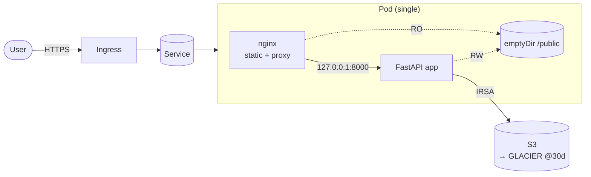

# Spidersilk

A small, production-shaped CSV ingestion service: upload a stock-on-hand CSV, see the rows in the browser, archive the original to S3 with a Glacier lifecycle, and list previously processed files — all running on Kubernetes provisioned with kops, packaged with Helm, configured with Ansible, and CI'd through GitHub Actions.



Full architecture: [`docs/architecture.md`](docs/architecture.md) · diagram source: [`docs/architecture.drawio`](docs/architecture.drawio) · runbook: [`docs/runbook.md`](docs/runbook.md).

## Repository layout

```
spidersilk/
├── app/                 # FastAPI service (Python 3.12) + Dockerfile + tests
├── helm/spidersilk/     # Helm chart (Deployment, Service, HPA, PDB, Ingress, SA, ConfigMap)
├── ansible/             # roles: app-config (renders values), helm-deploy (installs chart)
├── infra/
│   ├── kops/            # cluster.yaml + 5 IGs (3x control-plane HA, 1 on-demand, 1 spot mixed)
│   ├── cluster-autoscaler/  # Helm values for autoscaler/cluster-autoscaler
│   └── terraform/       # S3 bucket + lifecycle + IRSA role
├── .github/workflows/   # ci.yml (lint/test/validate), release.yml (image build & push)
├── docs/                # architecture.md, runbook.md, architecture.drawio
└── Makefile             # one-liners for every common task
```

## Five-minute local demo (kind)

```bash
make kind-up
make kind-deploy
kubectl -n spidersilk port-forward svc/spidersilk 8080:80 &
open http://localhost:8080
```

Upload `samples/soh.csv` (the sample CSV that ships with the repo). To make `/files` non-empty, point the app at an S3 endpoint via env (`SPIDERSILK_S3_ENDPOINT_URL`, e.g. LocalStack) or run against a real bucket.

## Quality gates

```bash
make lint           # ruff + helm lint + terraform fmt + ansible-lint
make test           # pytest (uses moto for S3)
make kubeconform    # validate rendered manifests
make tf-validate    # terraform init -backend=false + validate
```

These are the same checks CI runs.

### Pre-submission validation status

| Check | Tool | Result |
|---|---|---|
| Python tests | `pytest` (with `moto` mocking S3) | **8/8 pass** |
| Python lint | `ruff` | **clean** |
| Helm chart lint | `helm lint` | **pass** |
| Helm chart render (dev) | `helm template` | **7 manifests** |
| Helm chart render (prod) | `helm template -f values-prod.yaml` | **8 manifests** |
| Structural assertions on rendered Deployment | python yaml parser | RW/RO mount split, probes, resources, security context all verified |
| Terraform syntax | `terraform fmt -check -recursive` | **pass** |
| Terraform validation | `terraform init && terraform validate` | **pass** |
| Terraform plan (real AWS) | `terraform plan` | **8 resources ready to add** |
| Ansible playbook | `ansible-playbook --syntax-check` | **pass** |
| Ansible end-to-end render | `ansible-playbook --tags config` then `helm template -f rendered-values.yaml` | **7 manifests** |
| Live app smoke test | `uvicorn` + `curl` | `/healthz`, `/readyz`, `/`, `/static/style.css`, `/upload` of real 750-row CSV all behave correctly; shared `/public/static/` volume seeded as designed |
| Wheel build | `pip wheel` + install in clean venv | builds, installs, `spidersilk` entrypoint registered, templates+static included in wheel |

## Production deployment (one-shot)

```bash
# 1) AWS substrate
( cd infra/terraform && terraform init && terraform apply )

# 2) Cluster
export KOPS_STATE_STORE=s3://spidersilk-kops-state
aws s3 mb $KOPS_STATE_STORE --region us-east-1
aws s3 mb s3://spidersilk-kops-oidc --region us-east-1
kops create -f infra/kops/cluster.yaml \
            -f infra/kops/ig-control-plane.yaml \
            -f infra/kops/ig-ondemand-workers.yaml \
            -f infra/kops/ig-spot-workers.yaml
kops create secret --name spidersilk.k8s.local sshpublickey admin -i ~/.ssh/id_rsa.pub
kops update cluster --name spidersilk.k8s.local --yes --admin
kops validate cluster --wait 15m

# 3) Re-apply terraform with the cluster's OIDC details
( cd infra/terraform && terraform apply -var create_irsa_role=true -var oidc_provider_arn=... -var oidc_provider_url=... )

# 4) Deploy app
( cd ansible && ansible-playbook playbook.yml \
    --extra-vars "env=prod image_tag=0.1.0 service_account_role_arn=$(cd ../infra/terraform && terraform output -raw app_role_arn)" )
```

## Design decisions (the "why")

| Decision | Choice | Why |
|---|---|---|
| Web framework | FastAPI | Smallest viable surface; async by default; great DX. |
| Static asset sharing | `emptyDir` shared between `nginx` and `app` in **the same pod** | Requirement: shared storage but **not** NFS. emptyDir is the textbook sidecar pattern. App seeds assets at startup; nginx serves them read-only. |
| "Previously processed files" persistence | `ListObjectsV2` against S3 | Keeps the app stateless. No DB == fewer failure modes. |
| S3 + Glacier as code | Terraform | Industry standard; drift-detectable; readable diffs. |
| Lifecycle policy | GLACIER @30d, expire @365d, noncurrent expire @90d, abort MPU @7d | Sensible defaults; tuneable via variables. |
| Cluster | kops, AWS, 3-AZ HA, mixed instance + spot worker IG | Required by the task and a real production posture. |
| Auth to S3 | IRSA | Zero long-lived keys. |
| Helm chart | Deployment + Service + HPA + PDB + ConfigMap + SA + Ingress (opt-in) | Hits the autoscaling, env-reuse, and service-exposure requirements. |
| Ansible scope | Render values from group_vars + `helm upgrade --install` | "Application configs in Ansible" interpreted broadly enough to be useful, narrowly enough to avoid duplicating Helm. |
| CI/CD | GitHub Actions: lint+test+validate on PR, multi-arch image build+scan on tag | Reasonable baseline for any service. |
| Security | non-root, read-only FS, dropped caps, seccomp `RuntimeDefault`, deny-non-TLS on bucket, BPA on bucket, SSE-S3, versioning, Trivy in CI | Standard hardening every prod workload should ship with. |
