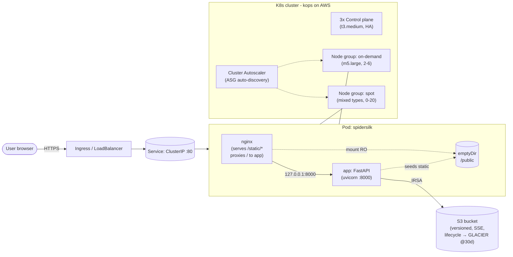

# Architecture

## Overview

Spidersilk is a small CSV ingestion service deployed on Kubernetes. A user uploads a `soh.csv`-shaped file, the app parses it, renders the rows to the browser, and archives the original to S3 with a Glacier transition lifecycle. Listings of previously processed files come straight out of S3 (`ListObjectsV2`) — the app is stateless.

## Diagram (source of truth)

The canonical diagram is `architecture.drawio` (open in <https://draw.io>); the exported `architecture.png` is the embeddable copy.

For quick rendering on GitHub, here is an equivalent Mermaid view:

## Component breakdown

### Application (FastAPI, Python 3.12)

- **Routes**: `GET /` (upload form), `POST /upload` (parse + archive), `GET /files` (list S3 objects), `GET /healthz`, `GET /readyz`.
- **Parsing**: streaming CSV reader; validates 3 columns and float prices; rejects malformed rows with HTTP 422.
- **Storage**: `boto3` S3 client using the default credential chain (IRSA in cluster, env vars locally). Server-side encryption AES256.
- **Static assets**: shipped inside the image at `spidersilk/static/`. On startup, the app seeds `/public/static/` (the shared volume) so the nginx sidecar can serve them.

### Pod layout (single pod, two containers)

- `nginx` (nginxinc/nginx-unprivileged) listens on `:8080`, reverse-proxies `/` to `localhost:8000`, serves `/static/*` from `/public/static/` (mounted **read-only**).
- `app` writes to `/public/static/` on startup (mounted **read-write**), serves the dynamic routes.
- **Shared storage**: a single `emptyDir` volume mounted into both containers. Not NFS (per requirement). Limited to 64 MiB. Lives and dies with the pod, which is fine because the assets are baked into the image.

### Helm chart (`helm/spidersilk`)

- `Deployment` (2 containers, shared volume), `Service` (ClusterIP), `HPA` (v2, CPU+memory), `PodDisruptionBudget`, `ServiceAccount` (IRSA-annotated in prod), `Ingress` (opt-in), `ConfigMap` (app env vars + `nginx.conf`).
- Values are layered: `values.yaml` (defaults), `values-prod.yaml` (prod overrides). Ansible renders an additional values file with environment-specific knobs.
- Hardening: non-root user, read-only root FS, dropped Linux caps, `RuntimeDefault` seccomp, pod anti-affinity across nodes.

### Cluster (kops on AWS)

- **3-AZ HA control plane** (one IG per AZ, single instance each, etcd quorum of 3).
- **On-demand worker IG** (`m5.large`, 2–6 nodes) for system / critical workloads — untainted, gets system pods.
- **Spot worker IG** with `mixedInstancesPolicy` (5 instance types), `capacity-optimized` allocation, 0–20 nodes, tainted `spot=true:NoSchedule`. Workloads opt in via tolerations.
- **Cluster Autoscaler** auto-discovers ASGs by tag (`k8s.io/cluster-autoscaler/<cluster-name>=owned`), uses `least-waste` expander, balances similar groups.
- **IRSA**: OIDC issuer discovery store enabled in `cluster.yaml`; Terraform creates the role and trust policy referencing the cluster's OIDC provider.

### Storage & lifecycle (Terraform)

- `aws_s3_bucket` with:
  - Versioning enabled.
  - SSE-S3 (AES256) with bucket key.
  - `BucketOwnerEnforced` ownership.
  - Public access fully blocked.
  - Bucket policy denying any non-TLS request.
- `aws_s3_bucket_lifecycle_configuration`:
  - Current versions → `GLACIER` after 30 days, expire after 365 days.
  - Noncurrent versions → `GLACIER` after 30 days, expire after 90 days.
  - Abort incomplete multipart uploads after 7 days.

### Configuration management (Ansible)

- `roles/app-config`: renders `values.yaml.j2` from `group_vars` into a temp file.
- `roles/helm-deploy`: lints the chart, ensures the namespace, runs `helm upgrade --install --atomic --wait`, then waits for the rollout. Idempotent.
- Single command from a clean machine: `ansible-playbook ansible/playbook.yml --extra-vars "env=prod ..."`.

### CI/CD (GitHub Actions)

- `ci.yml`: on every PR — Python ruff+pytest, helm lint+template+kubeconform, terraform fmt+validate, ansible-lint, Trivy filesystem scan.
- `release.yml`: on `v*.*.*` tag — multi-arch Docker buildx (amd64 + arm64), push to Docker Hub, Trivy image scan (fail-closed on HIGH/CRITICAL).

## Trust & failure model

- **Secrets**: zero long-lived AWS keys anywhere. IRSA only.
- **PII / data sensitivity**: CSV is treated as opaque payload. SSE-S3 at rest, TLS in transit (enforced by bucket policy).
- **Blast radius of a compromised pod**: limited to `PutObject` / `GetObject` / `ListBucket` on this single bucket (IAM policy in `iam.tf`).
- **Node loss (spot interruption)**: PDB keeps ≥1 replica up; HPA + CA bring replacements. Add `aws-node-termination-handler` for graceful drains.
- **Region loss**: out of scope. Add S3 CRR + a stand-by cluster if multi-region DR is required.
